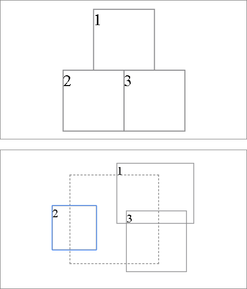

# react-windows-component

[](https://travis-ci.com/wikiwang1991/react-windows-component)

## Screenshots



<!-- ## Feature -->

## Usage

```jsx
import React from 'react'
import {Windows, Window} from 'react-windows-component'

export default MyWindows = () => {
  return <Windows>
    <Window x={30} y={0} w={60} h={60}>
      1
    </Window>
    <Window x={0} y={0.5} w={0.5} h={0.5}>
      2
    </Window>
    <Window x='1/2' y='1/2' w='1/2' h='1/2'>
      3
    </Window>
  </Windows>
}
```
## Examples

    cd react-windows-component
    yarn start

and then goto http://localhost:10001/

## API

### Window

| Property | Description | Type | Default |
| - | - | - | - |
| x | | `number` | |
| y | | `number` | |
| w | | `number` | |
| h | | `number` | |
| movable | | `boolean` | `false` |
| resizable | | `boolean` | `false` |

### Windows

| Property | Description | Type | Default |
| - | - | - | - |
| movable | | `boolean` | `false` |
| scalable | | `boolean` | `false` |
| width | | `number` | `120` |
| height | | `number` | `120` |
| innerStyle | | `CSSProperties` | |
| cover | | `React.ReactNode` | |
| scale | | `number` | |
| onFocus | | `function({key})` | |
| onBlur | | `function()` | |
| onWindowChange | | `function({key, x, y, w, h})` | |
| magnet | | `[var]` | |
